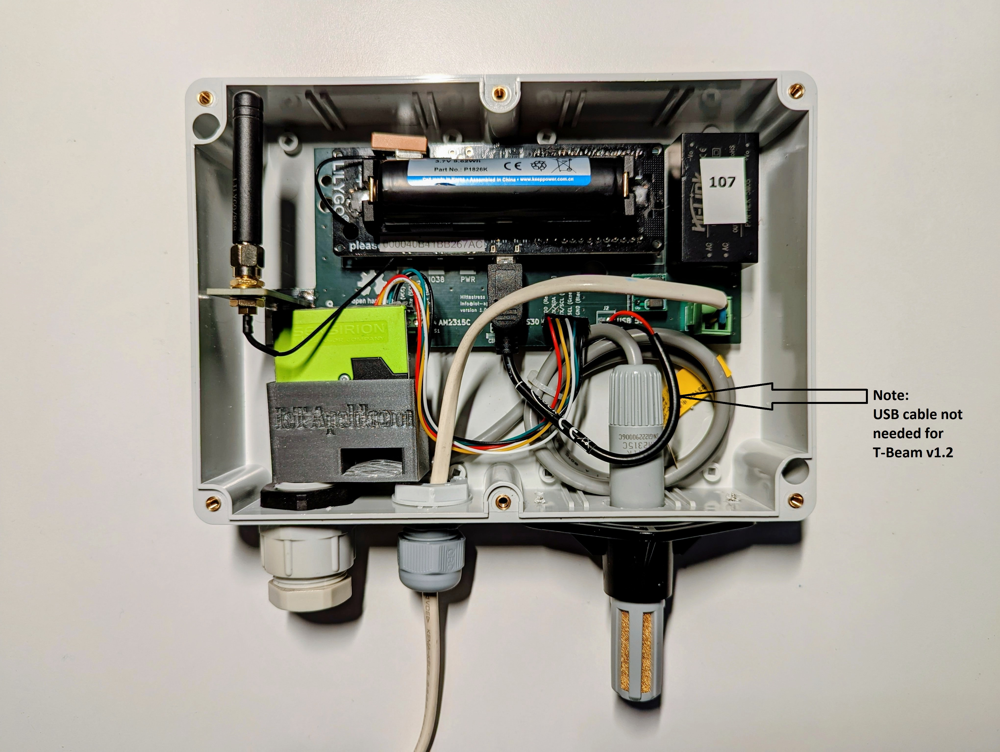

# Drillplan

This is the [drillplan](drillPlan.png) for the housing. 
The drill plan shows the bottom plane of a [Kradex Z74 ABS enclosure](../documentation/Z74.pdf).

## Overview of the housing

>This is the previous version using the older version of the Heltec T-Beam that is powered over USB.

>This shows the raster of the SPS30 particle sensor.

## SPS30 holder

The [SPS30 holder](hittestress2025_SPS_omhulsel_TPU.stl) is a devative work from [pe0ter](https://www.thingiverse.com/pe0ter) his [SPS30 PM sensor adapter](https://www.thingiverse.com/thing:4851976). 

